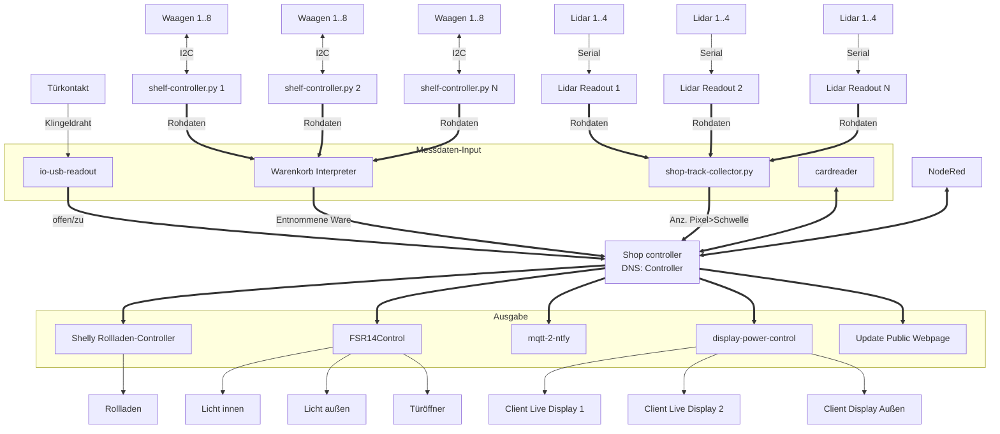

```mermaid
graph TD
  W1["Waagen 1..8"] <--> |I2C| WC1
  W2["Waagen 1..8"] <--> |I2C| WC2
  W3["Waagen 1..8"] <--> |I2C| WCN
  WC1["shelf-controller.py 1"] ==> |Rohdaten| WI
  WC2["shelf-controller.py 2"] ==> |Rohdaten| WI
  WCN["shelf-controller.py N"] ==> |Rohdaten| WI

  L1["Lidar 1..4"] --> |Serial| ST1
  L2["Lidar 1..4"] --> |Serial| ST2
  LN["Lidar 1..4"] --> |Serial| STN

  ST1["Lidar Readout 1"] ==> |Rohdaten| STI
  ST2["Lidar Readout 2"] ==> |Rohdaten| STI
  STN["Lidar Readout N"] ==> |Rohdaten| STI

  Türkontakt --> |Klingeldraht| IOR

  SC["Shop controller\nDNS: Controller"]


subgraph Messdaten-Input
  WI["Warenkorb Interpreter"]
  cardreader
  STI["shop-track-collector.py"]
  IOR["io-usb-readout"]
end

subgraph Ausgabe
  FSR["FSR14Control"]
  DPC["display-power-control"]

  MN["mqtt-2-ntfy"]

  Shelly["Shelly Rollladen-Controller"]

  UW["Update Public Webpage"]
end

  SC ==> Shelly --> Rollladen
 
  IOR ==> |offen/zu| SC

  DPC --> CD1
  DPC --> CD2
  DPC --> CDA

  CD1["Client Live Display 1"]
  CD2["Client Live Display 2"]
  CDA["Client Display Außen"]

  FSR --> LI["Licht innen"]
  FSR --> LA["Licht außen"]
  FSR --> Türöffner

  WI ==> |Entnommene Ware| SC
  STI ==> |Anz. Pixel>Schwelle| SC
  cardreader <==> SC

  SC ==> FSR
  SC ==> DPC

  SC ==> MN

  SC ==> UW

  NR["NodeRed"] <==> SC
```