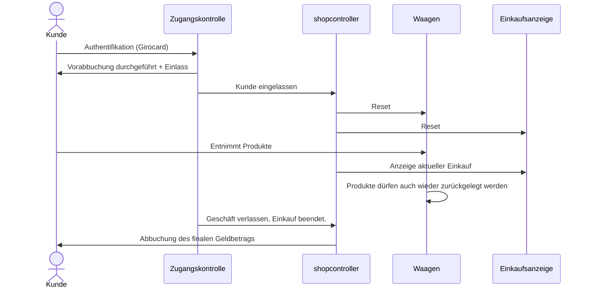
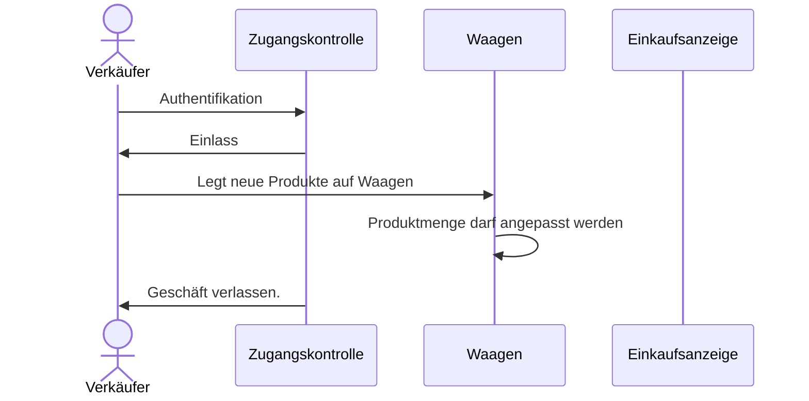

# Einkauf

```mermaid
sequenceDiagram
    actor Kunde
    participant Zugangskontrolle
    participant shopcontroller
    participant Waagen
    participant Einkaufsanzeige
    Kunde->>Zugangskontrolle: Authentifikation (Girocard)
    Zugangskontrolle->>Kunde: Vorabbuchung durchgeführt + Einlass
    Zugangskontrolle->>shopcontroller: Kunde eingelassen
    shopcontroller->>Waagen: Reset
    shopcontroller->>Einkaufsanzeige: Reset
    Kunde->>Waagen: Entnimmt Produkte
    shopcontroller->>Einkaufsanzeige: Anzeige aktueller Einkauf
    Waagen->>Waagen: Produkte dürfen auch wieder zurückgelegt werden
    Zugangskontrolle->>shopcontroller: Geschäft verlassen, Einkauf beendet.
    shopcontroller->>Kunde: Abbuchung des finalen Geldbetrags
```

# Bestückung

```mermaid
sequenceDiagram
    actor Verkäufer
    participant Zugangskontrolle
    participant Waagen
    participant Einkaufsanzeige
    Verkäufer->>Zugangskontrolle: Authentifikation
    Zugangskontrolle->>Verkäufer: Einlass
    Verkäufer->>Waagen: Legt neue Produkte auf Waagen
    Waagen->>Waagen: Produktmenge darf angepasst werden
    Zugangskontrolle->>Verkäufer: Geschäft verlassen.
```
