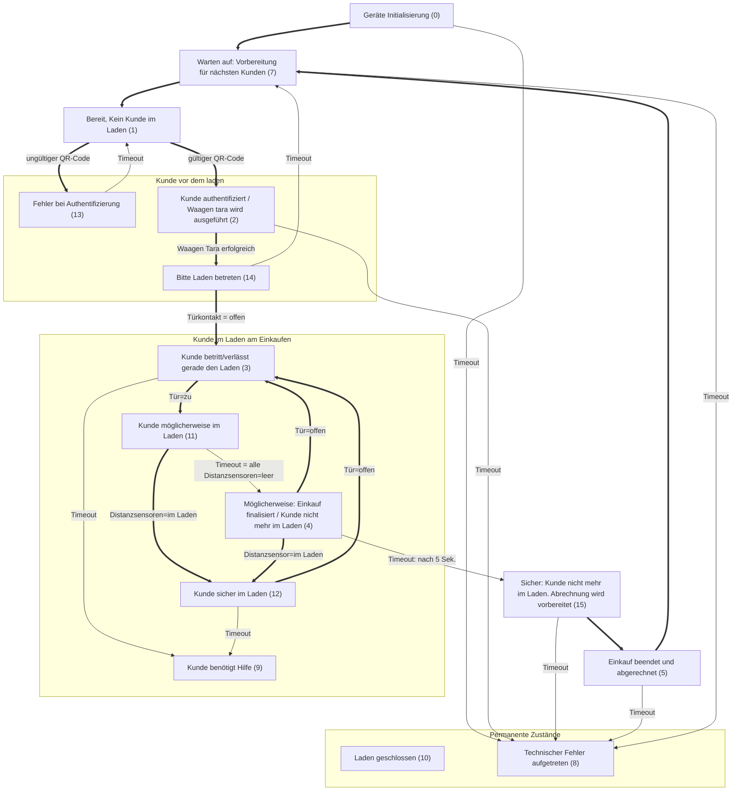
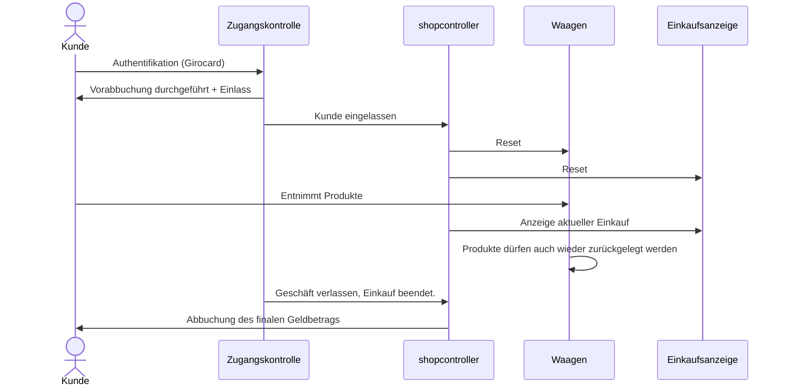
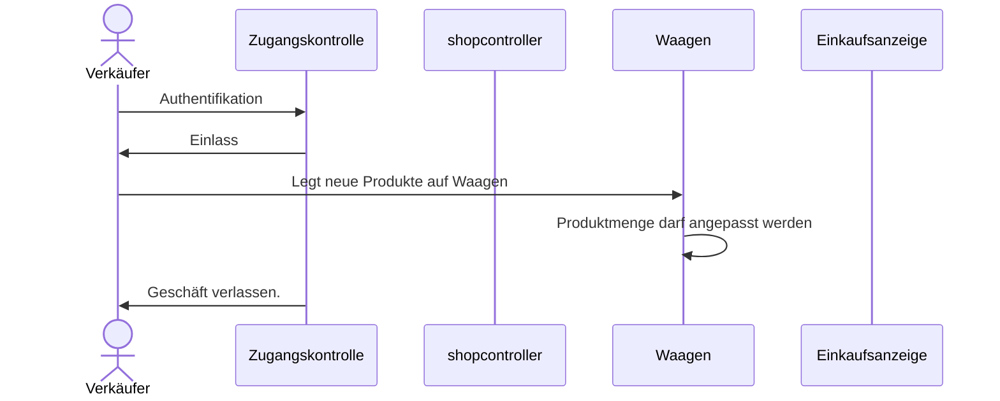

# Mögliche Zustände Shop_Controller

```mermaid
graph TD
  AA["Geräte Initialisierung (0)"]
  A["Bereit, Kein Kunde im Laden (1)"]
subgraph Kunde vor dem laden
  AF["Fehler bei Authentifizierung (13)"]
  B["Kunde authentifiziert / Waagen tara wird ausgeführt (2)"]
  BB["Bitte Laden betreten (14)"]
end
subgraph Kunde im Laden am Einkaufen
  C["Kunde betritt/verlässt gerade den Laden (3)"]
  CC["Kunde möglicherweise im Laden (11)"]
  CCC["Kunde sicher im Laden (12)"]
  D["Möglicherweise: Einkauf finalisiert / Kunde nicht mehr im Laden (4)"]
  Z["Kunde benötigt Hilfe (9)"]
end
  DD["Sicher: Kunde nicht mehr im Laden. Abrechnung wird vorbereitet (15)"]
  E["Einkauf beendet und abgerechnet (5)"]
  G["Warten auf: Vorbereitung für nächsten Kunden (7)"]
subgraph Permanente Zustände
  W["Laden geschlossen (10)"]
  Y["Technischer Fehler aufgetreten (8)"]
end
  AA ==> G
  AA --> |Timeout| Y
  A ==> |gültiger QR-Code| B
  A ==> |ungültiger QR-Code| AF
  B ==> |Waagen Tara erfolgreich| BB
  AF --> |Timeout| A
  B --> |Timeout| Y
  BB --> |Timeout| G
  BB ==> |Türkontakt = offen| C
  C ==> |Tür=zu| CC
  C --> |Timeout| Z
  CC ==> |Distanzsensoren=im Laden| CCC
  CCC ==> |Tür=offen| C
  CCC -->|Timeout| Z
  CC --> |Timeout = alle Distanzsensoren=leer| D
  D --> |Timeout: nach 5 Sek.| DD
  D ==> |Tür=offen| C
  D ==> |Distanzsensor=im Laden| CCC
  DD ==> E
  DD --> |Timeout| Y
  E ==> G
  E --> |Timeout| Y
  G ==> A
  G --> |Timeout| Y
  
```

# Nicht ganz aktuell:

## Einkauf

```mermaid
sequenceDiagram
    actor Kunde
    participant Zugangskontrolle
    participant shopcontroller
    participant Waagen
    participant Einkaufsanzeige
    Kunde->>Zugangskontrolle: Authentifikation (Girocard)
    Zugangskontrolle->>Kunde: Vorabbuchung durchgeführt + Einlass
    Zugangskontrolle->>shopcontroller: Kunde eingelassen
    shopcontroller->>Waagen: Reset
    shopcontroller->>Einkaufsanzeige: Reset
    Kunde->>Waagen: Entnimmt Produkte
    shopcontroller->>Einkaufsanzeige: Anzeige aktueller Einkauf
    Waagen->>Waagen: Produkte dürfen auch wieder zurückgelegt werden
    Zugangskontrolle->>shopcontroller: Geschäft verlassen, Einkauf beendet.
    shopcontroller->>Kunde: Abbuchung des finalen Geldbetrags
```

## Bestückung

```mermaid
sequenceDiagram
    actor Verkäufer
    participant Zugangskontrolle
    participant shopcontroller
    participant Waagen
    participant Einkaufsanzeige
    Verkäufer->>Zugangskontrolle: Authentifikation
    Zugangskontrolle->>Verkäufer: Einlass
    Verkäufer->>Waagen: Legt neue Produkte auf Waagen
    Waagen->>Waagen: Produktmenge darf angepasst werden
    Zugangskontrolle->>Verkäufer: Geschäft verlassen.
```
