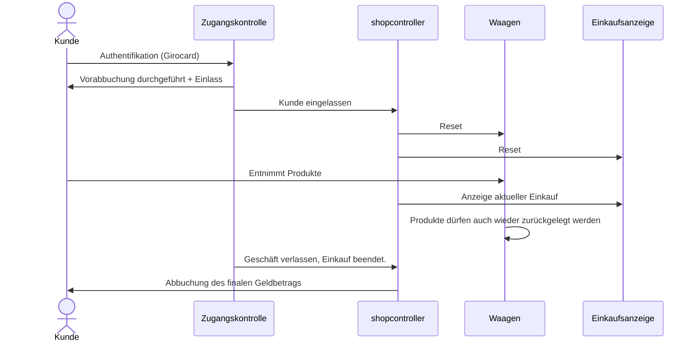
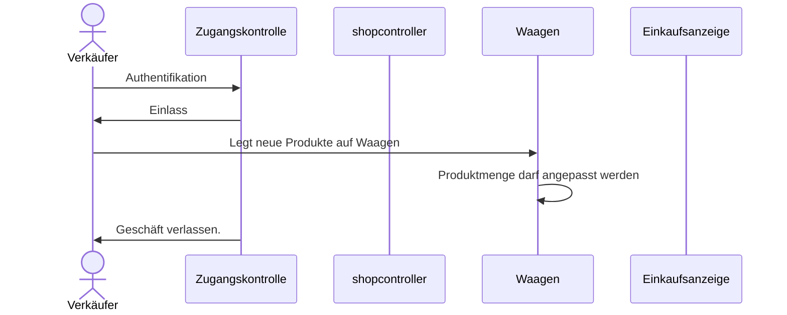

# Mögliche Zustände Shop_Controller
```mermaid
graph TD
subgraph Vorbereitung
  AA["Geräte Initialisierung (0)"]:::StyleHighlightInit
  G["Warten auf:\n Vorbereitung für nächsten Kunden\nKartenterminal bereit? (7)"]
end  
subgraph Kunde vor dem Laden
  A["Bereit\nKein Kunde im Laden\nKartenterminal aktiv (1)"]:::StyleHighlight
  AF["Fehler bei Kartenterminal (13)"]:::StyleHighlightError
  AF2["Timeout Kartenterminal (16)"]
  B["Kunde authentifiziert/\nWaagen tara wird ausgeführt (2)"]
  BB["Bitte Laden betreten (14)"]
end
subgraph Kunde im Laden am Einkaufen
  C["Kunde betritt/verlässt gerade den Laden (3)"]
  CC["Kunde möglicherweise im Laden (11)"]
  CCC["Kunde sicher im Laden (12)"]:::StyleHighlight
  D["Möglicherweise: Einkauf finalisiert /\nKunde nicht mehr im Laden (4)"]
  Z["Kunde benötigt Hilfe (9)"]:::StyleHighlightError
end

subgraph Kunde vor dem Laden, Bezahlvorgang
  DD["Sicher: Kunde nicht mehr im Laden.\nKartenterminal: buchen! (15)"]
  DD2["Warten auf:\nKartenterminal Buchung erfolgreich (17)"]
  E["Einkauf abgerechnet\nKassenbon-Anzeige (5)"]
end

subgraph Permanente Zustände
  W["Laden geschlossen (10)"]
  Y["Technischer Fehler aufgetreten (8)"]:::StyleHighlightError
end
  AA ==> G
  AA --> |Timeout| Y
  A ==> |Kartenterminal gültig| B
  A ==> |Timeout von Terminal| AF2
  AF2 ==> |Timeout, 1 Sek.| A
  A ==> |Fehler vom Kartenterminal| AF
  B ==> |Waagen Tara erfolgreich| BB
  AF --> |Timeout| G
  B --> |Timeout| Y
  BB --> |Timeout| G
  BB ==> |Türkontakt = offen| C
  C ==> |Tür=zu| CC
  C --> |Timeout| Z
  CC ==> |Distanzsensoren=im Laden| CCC
  CC ==> |Tür offen| C
  CCC ==> |Tür=offen| C
  CCC -->|Timeout| Z
  CC --> |Timeout = alle Distanzsensoren=leer| D
  D --> |Timeout: nach 5 Sek.| DD
  D ==> |Tür=offen| C
  D ==> |Distanzsensor=im Laden| CCC
  DD ==> DD2
  DD2 ==> E
  DD2 ==>|Fehler / Timeout| Y
  DD --> |Timeout| Y
  E --> |Timeout, 60Sec.| G
  G ==> A
  G --> |Timeout| Y

classDef StyleHighlightInit fill:#0f0,color:#000
classDef StyleHighlight fill:#f96,color:#000
classDef StyleHighlightError fill:#f00,color:#000

```

# Nicht ganz aktuell:

## Einkauf




## Bestückung

