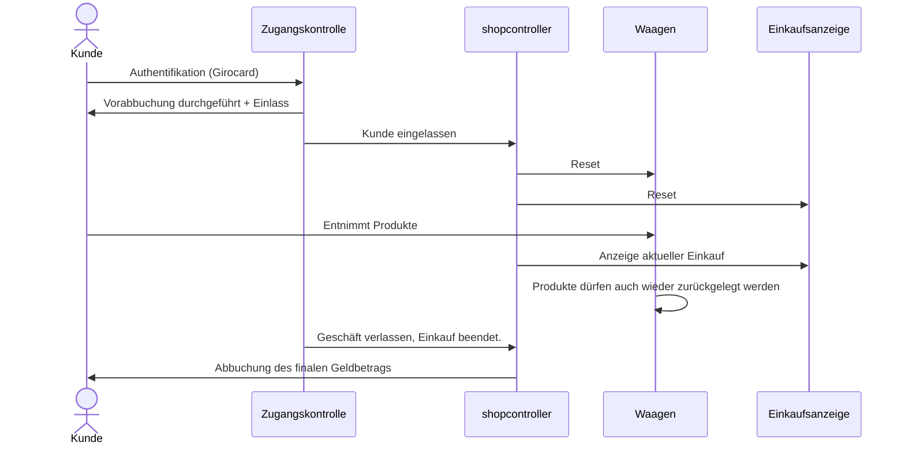

# Mögliche Zustände Shop_Controller
```mermaid
graph TD
subgraph Vorbereitung
  Z0["Geräte Initialisierung (0)"]:::StyleHighlightInit
  Z7["Warten auf:\n Vorbereitung für nächsten Kunden\nKartenterminal bereit? (7)"]
end  
subgraph Kunde vor dem Laden
  A["Bereit\nKein Kunde im Laden\nKartenterminal aktiv (1)"]:::StyleHighlight
  AF["Fehler bei Kartenterminal (13)"]:::StyleHighlightError
  AF2["Timeout Kartenterminal (16)"]
  B["Kunde authentifiziert/\nWaagen tara wird ausgeführt (2)"]
  Z14["Bitte Laden betreten (14)"]
end
subgraph Kunde im Laden am Einkaufen
  C["Kunde betritt/verlässt gerade den Laden (3)"]
  CC["Kunde möglicherweise im Laden (11)"]
  CCC["Kunde sicher im Laden (12)"]:::StyleHighlight
  D["Möglicherweise: Einkauf finalisiert /\nKunde nicht mehr im Laden (4)"]
end

subgraph Kunde vor dem Laden, Bezahlvorgang
  Z15["Sicher: Kunde nicht mehr im Laden.\nKartenterminal: buchen! (15)"]
  DD2["Warten auf:\nKartenterminal Buchung erfolgreich (17)"]
  E["Einkauf abgerechnet\nKassenbon-Anzeige (5)"]
end

subgraph Permanente Zustände
  W["Laden geschlossen (10)"]
  Z8["Technischer Fehler aufgetreten (8)"]:::StyleHighlightError
  Z9["Kunde benötigt Hilfe (9)"]:::StyleHighlightError
end
  Z0 ==> Z7
  Z0 --> |Timeout| Z8
  A ==> |Kartenterminal gültig| B
  A ==> |Timeout von Terminal| AF2
  AF2 ==> |Timeout, 120 Sek.| Z8
  AF2 ==> |Wenn busy==False, neues Pre-Auth senden| A
  A ==> |Fehler vom Kartenterminal| AF
  A ==> |Timeout nach > 60Sec. / Terminal erzeugt kein Timeout| Z8
  B ==> |Waagen Tara erfolgreich| Z14
  AF --> |Timeout| Z7
  B --> |Timeout| Z8
  Z14 --> |Timeout| Z15
  Z14 ==> |Türkontakt = offen| C
  C ==> |Tür=zu| CC
  C --> |Timeout| Z9
  CC ==> |Distanzsensoren=im Laden| CCC
  CC ==> |Tür offen| C
  CCC ==> |Tür=offen| C
  CCC -->|Timeout| Z9
  CC --> |Timeout = alle Distanzsensoren=leer| D
  D --> |Timeout: nach 5 Sek.| Z15
  D ==> |Tür=offen| C
  D ==> |Distanzsensor=im Laden| CCC
  Z15 ==> DD2
  DD2 ==> E
  DD2 ==>|Fehler / Timeout| Z8
  Z15 --> |Timeout| Z8
  E --> |Timeout, 60Sec.| Z7
  Z7 ==> AF2
  Z7 --> |Timeout| Z8

classDef StyleHighlightInit fill:#0f0,color:#000
classDef StyleHighlight fill:#f96,color:#000
classDef StyleHighlightError fill:#f00,color:#000

```


# Nicht ganz aktuell:

## Einkauf




