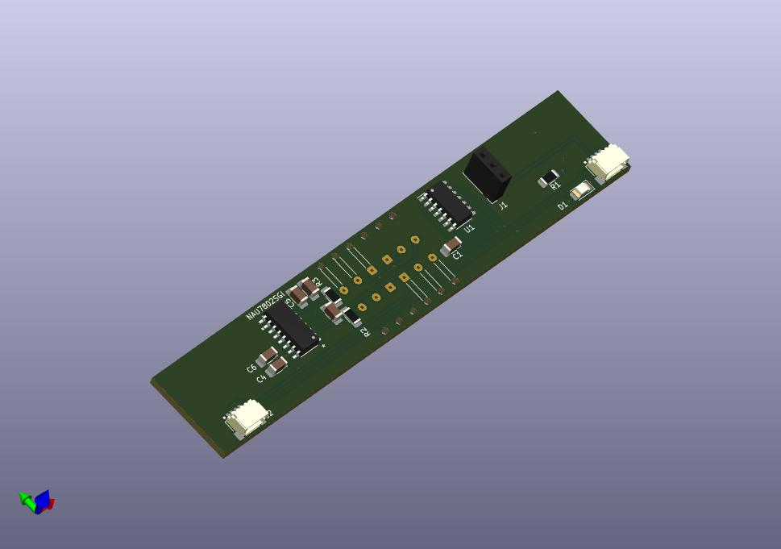
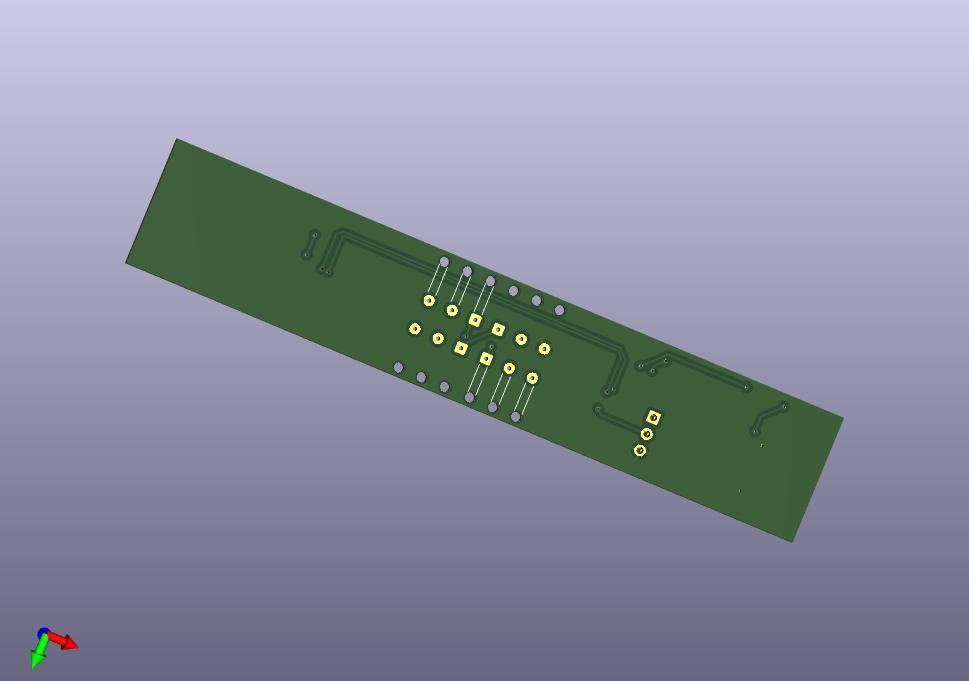

# Waage V4

* Waage aus 3D Drucker
* Wiegen mit 4 Wägezellen, Halbbrücke
* Kosten: 25€/Waage mit Druck und Elektornik, ohne Montage.
* Stand: Fertig entwickelt.

## 3D-Daten: 

[Modell hier herunterladen](https://cad.onshape.com/documents/e93dca015aaa1e9e19b301b1/w/7b48b7bfd47193fa3707ac4f/e/e2c3e895b10e82bbda4e5613?renderMode=0&uiState=649b429d2a16ba7928158867
) und ausdrucken via
* 3D FDM Drucker, oder
* https://craftcloud3d.com

## Elektronik-Platine:
* [Schematics](elektronik/illustrative/schematics.pdf)

## Materialien:
* Anschlusskabel: 
  * 50mm
  * https://www.mouser.de/ProductDetail/485-4399
* 4er Set Wägezellen:
  * Halbbrücken
  * 40cm Kabel
  * 1kOhm
  * https://www.aliexpress.com/item/1005004455387340.html
* Acrylglas Rundstab 2mm
  * klar, als Lichtleiter eingesetzt
  * https://hbholzmaus.de/epages/Store7_Shop34800.sf/de_DE/?ObjectPath=/Shops/Shop34800/Products/%2200-Ø2-00%22/SubProducts/%2200-Ø2-2000%22