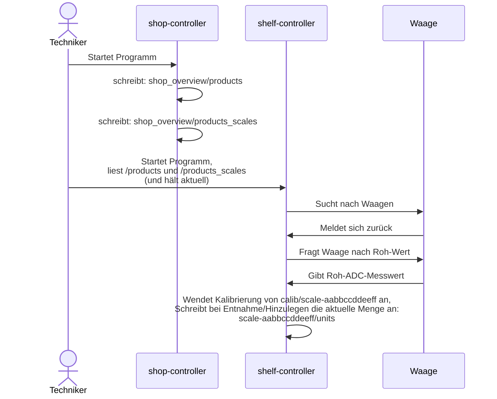

# Shelf Controller

- MQTT-Client name: `shelf01`, etc.
- MQTT-topic-prefix: `homie/shelf01`
- MAC-Adresse von Scale (6x 8byte): `aabbccddeeff`

| R/W | MQTT Topic   (ohne Topic-prefix) | Retain | Typischer Wert | Aktion |
| --- | --- |:---:| --- | --- |
| W | `/state` | X | `0` oder `1` | online / offline, per Last-Will gesetzt |
| R | `/cmd/start_search` | | | Erneut nach Waagen suchen |
| R | `/cmd/write_calib_to_mqtt` | | | Schreibe: `calib/scale-aabbccddeeff` `/scale_calibration_zero_in_raw`  und `calib/scale-aabbccddeeff` `/scale_calibration_slope` |
| W | `/scale-aabbccddeeff/state` | X | `0` oder `1` | online / offline (sollte jedoch `/state==0` sein, dann gelten diese Werte nur als historisch) |
| W | `calib/scale-aabbccddeeff` `/firmware_version` | X | `uint`  | Wird von der Waage ausgelesen |
| W | `calib/scale-aabbccddeeff` `/hardware_version` | X | `uint`  | Wird von der Waage ausgelesen |
| W | `calib/scale-aabbccddeeff` `/scale_calibration_zero_in_raw` | X | `32-bit uint`  | Waagen-Kalibration Roh-ADC-Wert bei 0kg auf Waage |
| W | `calib/scale-aabbccddeeff` `/scale_calibration_slope` | X | `double` | Waagen-Kalibration, Steigung nach Abzug des Roh-0kg-Werts, Ergebnis: kg |
| W | `/scale-aabbccddeeff` `/debug/i2c_address` | X | `9..117` (byte)  | I2C-Adresse der Waage, nur zur Info |
| W | `/scale-aabbccddeeff` `/debug/scale_product_id` | X | int  |  Doppelte-Überprüfung: Produkt korrekt zugeordnet, aus `homie/shop_controller/shop_overview/products_scales` |
| W | `/scale-aabbccddeeff` `/raw` | | `32-bit uint` | Roh-Messwert des ADCs (nur im Modus `-vv`) |
| W | `/scale-aabbccddeeff` `/mass` | | Wert in kg, double | Aktuelle Masse unter Anwendung der Kalibration ggf. unter Berücksichtigung der Temperatur |
| W | `/scale-aabbccddeeff` `/withdrawal_units` | X | int | Anzahl entnommener Produkte, berechnet aus Masse und Produktzuordnung
| R | `homie/shop_controller/prepare_for_next_customer` | | `1` | Reagiert auf diesen Topic, um `/withdrawal_units` zurückzusetzen und den Roh-ADC-Wert ggf. mit einem Offset zu versehen (in der Zeit, in dem keine Entnahme stattfindet).

## Start von shelf-controller

## Beispiele

| Topic | Wert | 
| --- | --- |
| `homie/shop_controller/shop_overview/products` | `{"1": {"ProductID": 1, "ProductName": "Kuerbis", "ProductDescription": "eigene Ernte", "PriceType": 0, "PricePerUnit": 4.0, "kgPerUnit": 1.67}, "2": {"ProductID": 2, "ProductName": "Nudeln", "ProductDescription": "Hausgemacht mit frischen Eiern", "PriceType": 0, "PricePerUnit": 2.6, "kgPerUnit": 0.5}, "3": {"ProductID": 3, "ProductName": "Cocktailtomaten", "ProductDescription": null, "PriceType": 0, "PricePerUnit": 4.45, "kgPerUnit": 0.5}, "4": {"ProductID": 4, "ProductName": "Tomaten", "ProductDescription": null, "PriceType": 0, "PricePerUnit": 2.15, "kgPerUnit": 0.6}, "5": {"ProductID": 5, "ProductName": "Eier L 10er", "ProductDescription": "aus Bodenhaltung", "PriceType": 0, "PricePerUnit": 3.3, "kgPerUnit": 0.6}, "6": {"ProductID": 6, "ProductName": "Weizenmehl", "ProductDescription": "1kg Type 550", "PriceType": 0, "PricePerUnit": 1.59, "kgPerUnit": 1.04}, "7": {"ProductID": 7, "ProductName": "Gummibaerchen", "ProductDescription": null, "PriceType": 0, "PricePerUnit": 1.9, "kgPerUnit": 0.155}, "8": {"ProductID": 8, "ProductName": "Haltbare Milch", "ProductDescription": "1L im Tetrapack", "PriceType": 0, "PricePerUnit": 1.69, "kgPerUnit": 1.1}, "9": {"ProductID": 9, "ProductName": "Birnen", "ProductDescription": "750g Eigene Ernte Alexander Lukas", "PriceType": 0, "PricePerUnit": 1.0, "kgPerUnit": 0.775}}}` |
| `homie/shop_controller/shop_overview/products_scales` | `{"shelf01/b963": 1, "shelf01/ca44": 2, "shelf01/d660": 5, "shelf01/3320": 6, "shelf01/1a6d": 7, "shelf01/1503": 8, "shelf01/12d4": 12, "shelf01/73d0": 17, "shelf01/95e": 18, "shelf01/2438": 19, "shelf01/84a7": 20, "shelf01/65c0": 21, "shelf01/7b87": 22, "shelf01/7e3e": 23}`